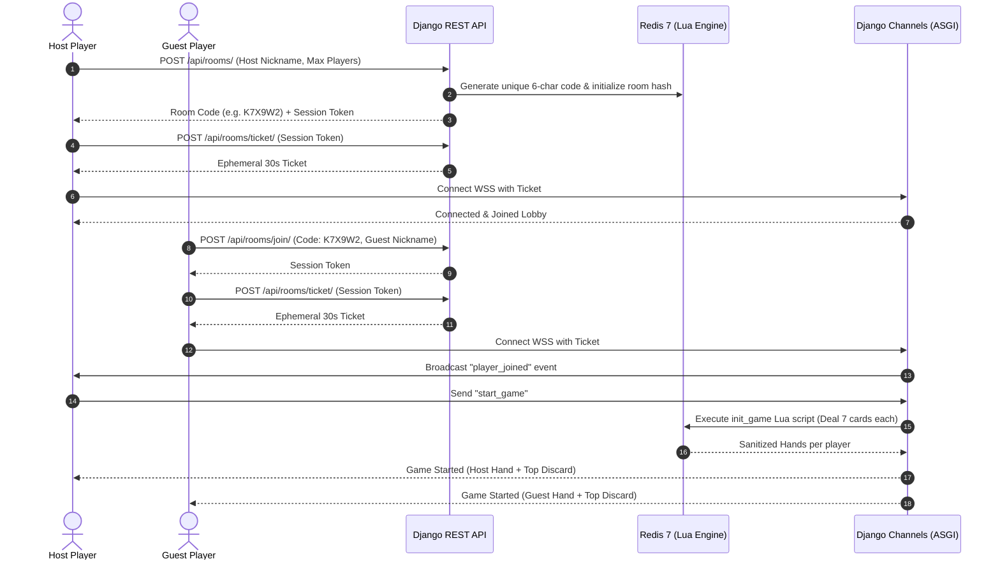

# Real-Time Multiplayer UNO Web Platform
> **Server-Authoritative, Zero-Friction Multiplayer Card Gaming on the Modern Web**

[](https://nextjs.org/)
[](https://www.typescriptlang.org/)
[](https://www.djangoproject.com/)
[-DC382D?style=flat&logo=redis)](https://redis.io/)
[](https://www.postgresql.org/)
[](https://www.docker.com/)

---

## 1. Executive Summary

The **Multiplayer UNO Web Platform** is an enterprise-grade, low-latency web implementation of the classic UNO card game designed for 2 to 6 players per room. It prioritizes **instant accessibility**—enabling players to jump into a game within 15 seconds through clean, 6-character room codes and shareable invite links, with zero account registration or downloads required.

Under the hood, the platform features a **strictly server-authoritative architecture**. Game rules, deck mutations, card legality, turn timelines, and draw queues are handled entirely on the backend to prevent cheating, card peeking, or desynchronization. High-concurrency WebSocket channels coupled with atomic Redis Lua scripts ensure instantaneous synchronization and rock-solid state consistency even under erratic mobile network conditions.

---

## 2. Core Pillars & Value Proposition

| Pillar | Architectural Implementation | Value to Player / Operator |
| :--- | :--- | :--- |
| **Frictionless Onboarding** | Guest sessions, ephemeral tickets, 6-char alphanumeric room codes (e.g., `K7X9W2`). | Eliminates drop-off; players create or join a game in under 15 seconds. |
| **Absolute Server Authority** | Pure Python deterministic game engine; client acts purely as an input-capture and render layer. | Guarantees fair play; completely eliminates client-side card injection and state spoofing. |
| **Zero Information Leakage** | Recipient-sanitized WebSocket serialization. Hands and deck sequence are hidden server-side. | Prevents memory snooping and devtools inspection of opponents' cards or next draws. |
| **Fault-Tolerant Resilience** | Distributed deadline timestamps, 45s disconnection grace periods, and auto-play bot fallbacks. | Prevents game stalls when players switch apps, experience lag, or abandon matches. |
| **Linearizable Concurrency** | Single-threaded Redis Lua scripts execute deck and turn mutations atomically. | Prevents race conditions, duplicate draws, and distributed lock deadlocks. |

---

## 3. Key Feature Matrix

### 🃏 Gameplay & Rules
* **Complete Standard UNO Deck (108 Cards):**
  * 76 Number Cards (Red, Blue, Green, Yellow: 0–9)
  * 24 Action Cards (Skip, Reverse, Draw Two across all 4 colors)
  * 8 Wild Cards (Standard Wild and Wild Draw Four)
* **Interactive "Call UNO" & Penalty Window:**
  * One-tap dedicated "Call UNO" trigger when holding 2 cards prior to playing down to 1.
  * 3-second open challenge window for opponents to catch a player who forgot to call UNO, forcing a 2-card draw penalty.
* **Turn Deadlines & AFK Mitigation:**
  * Distributed turn deadline countdown with visual pulse and audio chimes.
  * Automated fallback: auto-draws from the pile or passes turn if player timer expires.

### 💻 User Experience & Interface
* **Ergonomic Radial Seating:** Adapts automatically to 2, 3, 4, 5, or 6 players positioned around a central discard and draw stack.
* **Fluid 60 FPS Micro-Interactions:** Smooth card deal layouts, play transitions, and active turn highlights using Framer Motion.
* **Zero-Lag Spatial Audio:** Cross-browser sound effects (card deal, swoosh, skip alert, UNO shout, timer ticks) managed with Howler.js.
* **Fully Responsive:** Seamless layout transition between mobile portrait/landscape and desktop wide-screen monitors.

### 🔒 Security & Performance
* **Single-Use WebSocket Ticket Exchange:**
  * Prevents JWT/session token leakage in query strings, server logs, or proxy histories.
  * REST endpoint (`POST /api/rooms/ticket/`) issues a cryptographically secure 30-second single-use ticket.
* **Granular Rate Limiting:**
  * IP-based throttling for room creation (prevents room-squatting attacks).
  * WebSocket message throttling to avoid denial-of-service state flooding.
* **Automated Room Cleanup:**
  * Abandoned 1-player rooms expire in 5 minutes.
  * Completed or inactive rooms automatically decommissioned from Redis state memory.

---

## 4. Technical Architecture

```
                                  [ Client Browser ]
                               (Next.js 14 + Tailwind)
                                   /             \
                      HTTPS (REST) /               \ WSS (WebSockets)
                     Room / Ticket/                 \ Game Events
                                 /                   \
                                v                     v
                        ┌─────────────────────────────────────┐
                        │        NGINX Ingress Proxy          │
                        │  (Rate Limiting & WSS Term.)        │
                        └──────────────────┬──────────────────┘
                                           │
                                           v
                        ┌─────────────────────────────────────┐
                        │      Application Pod (Daphne)       │
                        │    - Django REST Framework (API)    │
                        │    - Django Channels 4 (ASGI)       │
                        │    - Pure Python Rule Engine        │
                        └──────────────┬───────────────┬──────┘
                                       │               │
                     Atomic Mutations  │               │ Match Logs & Audits
                       & Channel Bus   │               │
                                       v               v
                        ┌──────────────────┐    ┌──────────────────┐
                        │    Redis 7.x     │    │  PostgreSQL 16   │
                        │ - Lua Scripts    │    │ - Match History  │
                        │ - State Hashes   │    │ - Session Audit  │
                        │ - Turn Deadlines │    │ - Game Telemetry │
                        └──────────────────┘    └──────────────────┘
```

### Technology Stack Details

| Layer | Technologies | Key Responsibilities |
| :--- | :--- | :--- |
| **Frontend Client** | Next.js 14 (App Router), TypeScript, Tailwind CSS | UI rendering, client state management, audio synthesis, animation orchestration. |
| **State & Audio UI** | Framer Motion, Lucide Icons, Howler.js | 60fps card physics, tactile audio feedback, responsive iconography. |
| **Real-time Server** | Python 3.12, Django 5.x, Django Channels, Daphne | Asynchronous WebSocket event handling, room lifecycle management, API gateway. |
| **Core Game Engine** | Pure Python (`backend/engine`) | Deterministic card rules, deck generation, validation, state machine (100% unit-tested). |
| **In-Memory Store** | Redis 7.x | High-throughput channels layer, atomic Lua state transactions, ephemeral 30s tickets. |
| **Relational Storage** | PostgreSQL 16+ | Persistent record of finalized games, aggregate player statistics, and audit logs. |
| **Infrastructure** | Docker, Docker Compose, NGINX Alpine | Containerized microservices, unified reverse proxy, production ingress routing. |

---

## 5. Room Lifecycle & State Flow



---

## 6. Quick Start & Local Execution

### Prerequisites
* [Docker Desktop](https://www.docker.com/products/docker-desktop/) (v24.0+)
* [Docker Compose](https://docs.docker.com/compose/) (v2.0+)

### Running the Entire Stack via Docker
```bash
# Clone the repository
git clone https://github.com/rituharsh9436/UNO-Game-Play.git
cd UNO-Game-Play

# Build and start all services (Postgres, Redis, Backend, Frontend, NGINX)
docker compose up --build -d

# Check service health
docker compose ps
```
The application will be accessible at:
* **Frontend Application:** `http://localhost` (or `http://localhost:3000`)
* **Backend API / Admin:** `http://localhost:8000/api/`
* **Redis Instance:** `localhost:6379`
* **PostgreSQL:** `localhost:5432`

---

## 7. Project Status & Roadmap

- [x] **v1.0 - Core Engine Baseline:** Deterministic UNO rules, card deck models, and unit test suites.
- [x] **v2.0 - Real-Time Networking:** Django Channels ASGI setup, Redis Channel Layer, and WebSocket consumer routing.
- [x] **v2.1 - Concurrency & Security Hardening:** Atomic Redis Lua scripts, single-use ticket auth, and zero-trust sanitization.
- [x] **v2.2 - Interactive Web UI:** Responsive radial game board, turn indicators, and UNO challenge controls.
- [ ] **v2.3 - House Rule Customization:** Host-selectable options for "Stacking +2 / +4", "7-0 Pass Hand", and "Jump-In".
- [ ] **v2.4 - Spectator Mode:** Non-playing observer seats with shared live view for streaming and tournaments.
- [ ] **v2.5 - WebRTC Audio Rooms:** Optional proximity / table-side voice chat directly in the browser.
